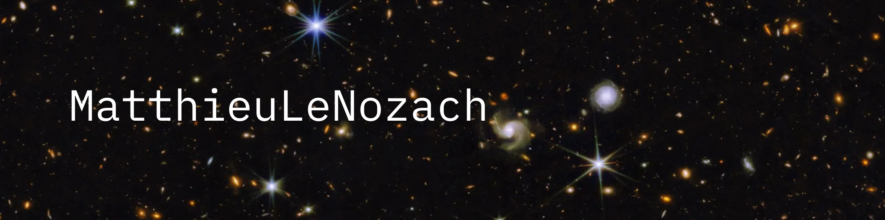

## Hi! 👋

I'm a switching carrer data enthusiast, passionate about deploying predictive models into user-friendly interfaces

- 🌱 Currently learning *Data Science* and *MLOps* (also enjoying *Web Backend*).
- 🚀 Looking for opportunities to collaborate on projects where I can contribute to building and deploying  ML/DL models and their user interfaces in real-world applications.
- 💡 Always excited to design useful features, solve problems and learn new technologies.

---
## 👥 Contributions

#### - ✅ [A bird sound classifier MVP deployment for an ornithology website](https://github.com/ValBaron10/BirdSoundClassif)

## 🏗️ Projects

### ML Ops

#### - ✅ [A FastAPI app template to serve machine learning models asynchronously, with built-in user management, service access policies, etc.](https://github.com/MatthieuLeNozach/api_basemodel_for_machine_learning_with_fastapi)

### Velib Project

#### - 🚧 [An Airflow orchestrated end to end project: Vélib API >> ELT >> dashboards & ML training](https://github.com/MatthieuLeNozach/velib_airflow_orchestration_elt_ml)

#### Miscellanous

#### - ✅ [An HTML résumé editor with TailwindCSS styling](https://github.com/MatthieuLeNozach/tailwindcss_resume/tree/main)

### Older projects
- 🕸️ [Accelerate the experimentation loop, using templated preprocessing pipelines, Optuna hyperparameter tuning and MLFlow experiment tracking](https://github.com/MatthieuLeNozach/mlflow_laboratory/tree/main)
- 🕸️ [Modelling and serving a classification model trained on imbalanced data](https://github.com/MatthieuLeNozach/insurance_classification_imalanced)

---
## 💻 Tech Stack:
- **Programming languages:**  
 

- **DB / Storage:**  
  

- **Data Manipulation:**  
 

- **DataViz:**  
   

- **Machine Learning / Deep Learning:**  
   

- **MLOps:**   
 

- **Backend**:  
   

- **OS & IDE & Tools :**  
        

## 📊 GitHub Stats:
 
<br/

